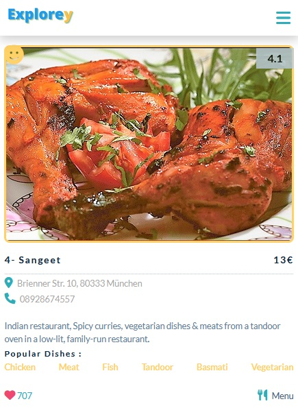
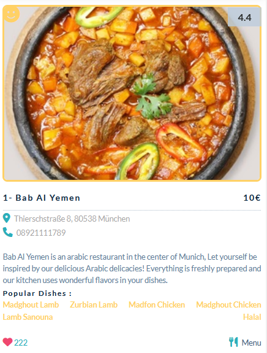
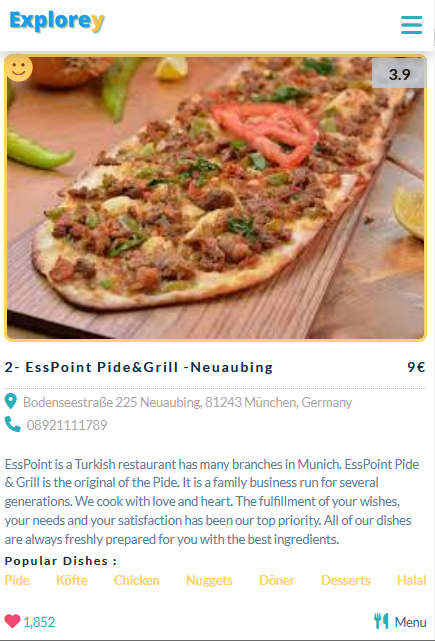
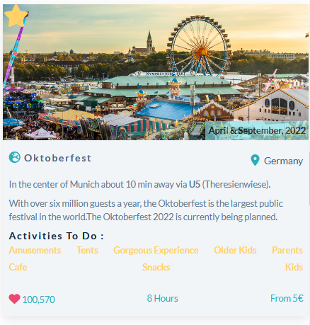
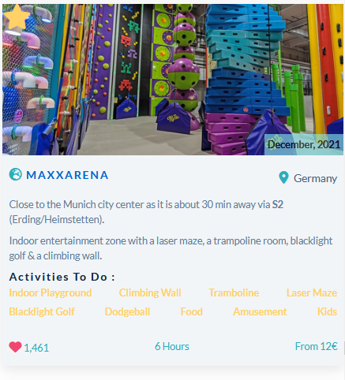
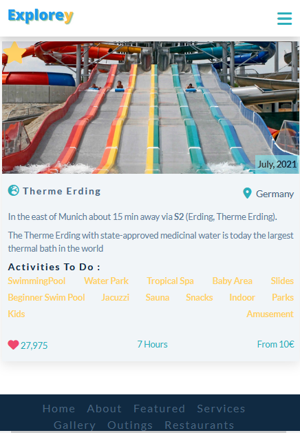

# Bayern To Explore
Simple web application about places and restaurants to visit in Munich.

If you are living in Munich, here is your reference for interesting Outings 🎡 ⛱️ , Restaurants 🥘 , Shopping 🛍️ and more . Find nice places to visit with your family in Munich and cities around.

Your guide to know good information about what is the activities that nice to explore.  ⛰️

- Responsive Design. 
- Flexbox & Css Grid for Columns Layouts.
- Navbar. 
- Sub Menu. 
- Animation. 
- External Icons from fontawesome.  
- Modules
- Search Option.

To run Demo : https://explory24.com/

## Screenshots 🎉

<table >
 <tr>
  <td></td>
  <td></td>
  <td></td>
 </tr>
 <tr>
  <td></td>
  <td></td>
  <td></td>
 </tr>
  <tr>
  <td></td>
  <td></td>
  <td></td>
 </tr>
  <tr>
  <td></td>
  <td></td>
  <td></td>
 </tr>
</table>